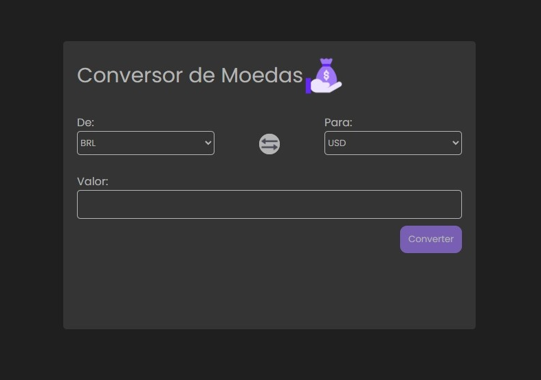

# 💱 Conversor de Moedas

Um projeto simples de conversão de moedas desenvolvido com **HTML**, **CSS** e **JavaScript**.  
O usuário escolhe as moedas de origem e destino, digita o valor que deseja converter e obtém o resultado na tela.

## 🚀 Funcionalidades

- Seleção da moeda de origem e destino
- Conversão baseada em taxas pré-definidas
- Interface simples e responsiva
- Atualização instantânea do resultado após a conversão

## 🛠️ Tecnologias utilizadas

- HTML5
- CSS3
- JavaScript

## 📸 Imagem do projeto

